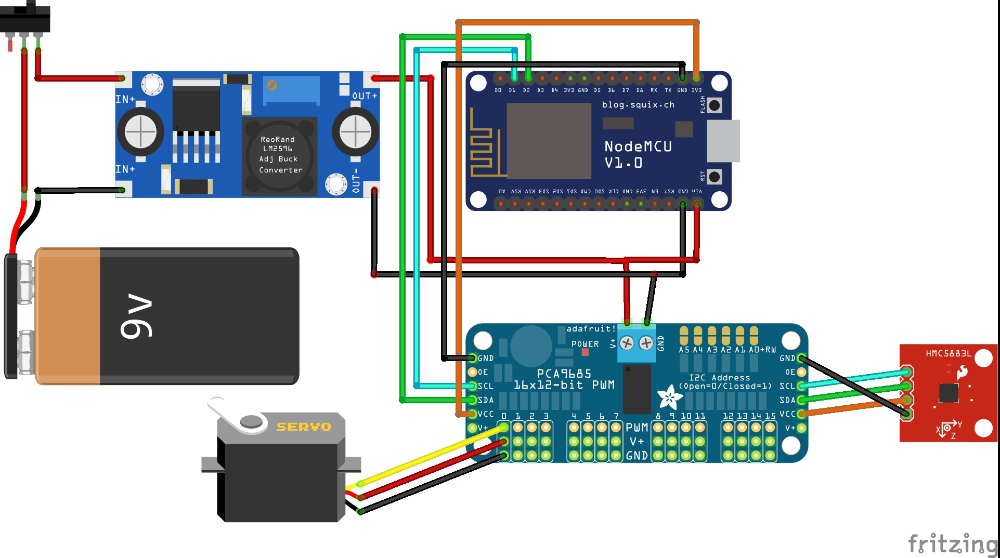

# Description
This robot used **ESP8266** as microcontroller. This robot has 6 legs with 2 servos in each leg, so the total servos that used is 12 servos. So, the robot used **PCA9685 PWM I2C module** to handle the servos. Then, the robot has difficulty walking straight, so it was used **Magnetometer HMC5883L** to control the direction when it starts to walk not straight. To operate this robot, we can use **Blynk** app that connected with ESP8266 by same WiFi.

# Video Demo
<a href="https://drive.google.com/file/d/1WwRouReJ9P6d5JnTYJYEWJwxoiFgsojx/view?usp=sharing">
  Click it to view video demo
</a>

# Block Diagram

# Schematic Design

